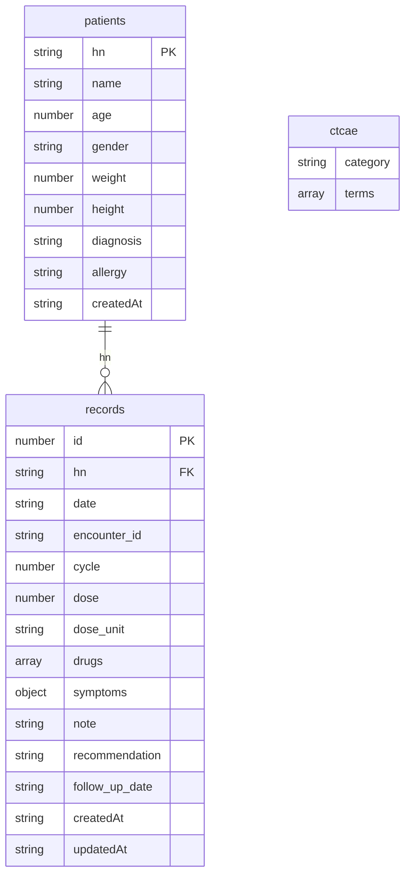

# 📋 ADR-T System — Data Schema & API Reference

> เอกสารนี้สำหรับทีม iMed/HIS เพื่อใช้ในการเชื่อมต่อระบบ  
> **Base URL**: `http://localhost:5000`  
> **Database**: JSON flat-file (data/*.json)  
> **Content-Type**: `application/json`

---

## 🗄️ Data Files

ระบบใช้ไฟล์ JSON สำหรับเก็บข้อมูลใน `./data/` directory

| ไฟล์             | คำอธิบาย                         |
|-----------------|-----------------------------------|
| `patients.json` | ข้อมูลผู้ป่วยทั้งหมด               |
| `records.json`  | ADR records ทั้งหมด               |
| `ctcae.json`    | ข้อมูล CTCAE (จัดกลุ่มตาม category) |

---

## 🧩 Data Structures

### 1. `patients` — ข้อมูลผู้ป่วย

| Field         | Type    | Required | คำอธิบาย                                         |
|---------------|---------|----------|--------------------------------------------------|
| `hn`          | string  | ✅ YES   | Hospital Number **(Primary Key — match กับ iMed)** |
| `name`        | string  | ✅ YES   | ชื่อ-นามสกุล                                      |
| `age`         | number  | YES      | อายุ (ปี)                                         |
| `gender`      | string  | YES      | เพศ เช่น `ชาย` / `หญิง`                           |
| `weight`      | number  | YES      | น้ำหนัก (kg) — ใช้คำนวณ BSA                       |
| `height`      | number  | YES      | ส่วนสูง (cm) — ใช้คำนวณ BSA                       |
| `diagnosis`   | string  | YES      | การวินิจฉัย เช่น `CA Breast`, `Lymphoma`          |
| `allergy`     | string  | NO       | ประวัติแพ้ยา                                      |
| `createdAt`   | string  | auto     | ISO 8601 timestamp ที่เพิ่มข้อมูล                  |

**BSA คำนวณจาก Mosteller formula:**
```
BSA (m²) = √( weight(kg) × height(cm) / 3600 )
```

**ตัวอย่าง Patient object:**
```json
{
  "hn": "HN-001234",
  "name": "นายสมชาย ใจดี",
  "age": 55,
  "gender": "ชาย",
  "weight": 65,
  "height": 170,
  "diagnosis": "CA Breast",
  "allergy": "Penicillin",
  "createdAt": "2025-05-28T08:00:00.000Z"
}
```

---

### 2. `records` — ADR Records (บันทึกอาการไม่พึงประสงค์)

| Field            | Type    | Required | คำอธิบาย                                                         |
|------------------|---------|----------|------------------------------------------------------------------|
| `id`             | number  | auto     | timestamp-based ID (Date.now()) — **Primary Key**                |
| `hn`             | string  | ✅ YES   | HN ของผู้ป่วย (FK → patients.hn)                                  |
| `date`           | string  | ✅ YES   | วันที่บันทึก format: `YYYY-MM-DD`                                  |
| `encounter_id`   | string  | NO       | VN หรือ AN ที่เชื่อมกับ encounter                                 |
| `cycle`          | number  | NO       | รอบยาเคมีบำบัด                                                    |
| `dose`           | number  | NO       | ขนาดยา                                                           |
| `dose_unit`      | string  | NO       | หน่วยยา เช่น `mg/m²`, `mg/kg`, `mg`                              |
| `drugs`          | array   | YES      | รายชื่อยาที่ผู้ป่วยได้รับ (string array)                          |
| `symptoms`       | object  | YES      | อาการไม่พึงประสงค์ — **ดู Symptoms Object ด้านล่าง**              |
| `note`           | string  | NO       | หมายเหตุเพิ่มเติม / คำแนะนำ                                      |
| `recommendation` | string  | NO       | คำแนะนำการรักษา                                                   |
| `follow_up_date` | string  | NO       | วันนัดติดตาม format: `YYYY-MM-DD`                                  |
| `patientName`    | string  | NO       | ชื่อผู้ป่วย (denormalized เพื่อ search)                           |
| `regimen`        | string  | NO       | สูตรยา (denormalized เพื่อ search)                                |
| `createdAt`      | string  | auto     | ISO 8601 timestamp ที่บันทึก                                      |
| `updatedAt`      | string  | auto     | ISO 8601 timestamp ที่แก้ไขล่าสุด                                 |

#### `symptoms` Object Structure

```json
{
  "nausea": {
    "grade": 2,
    "description": "Moderate nausea; decreased oral intake without significant weight loss",
    "label": "Nausea",
    "note": "",
    "isCustom": false
  },
  "custom_1716864000123_ab3x1": {
    "grade": 1,
    "description": "Mild skin discoloration",
    "label": "Skin hyperpigmentation",
    "note": "บริเวณข้อพับ",
    "isCustom": true
  }
}
```

| Field         | Type    | คำอธิบาย                                                         |
|---------------|---------|------------------------------------------------------------------|
| `[key]`       | string  | CTCAE term key เช่น `"nausea"` หรือ custom key `"custom_xxx_xxx"` |
| `grade`       | number  | ระดับความรุนแรง 1–5 (ดูตาราง CTCAE Grade ด้านล่าง)               |
| `description` | string  | คำอธิบายอาการตาม grade ที่เลือก                                   |
| `label`       | string  | ชื่ออาการที่แสดงผล                                                |
| `note`        | string  | บันทึกเพิ่มเติมเฉพาะอาการนี้                                      |
| `isCustom`    | boolean | `true` = อาการที่เภสัชกรเพิ่มเอง (ไม่อยู่ใน CTCAE standard)      |

#### CTCAE Grade Reference

| Grade | ระดับ             | สี (UI)     |
|-------|-------------------|-------------|
| 1     | Mild              | 🟢 Emerald  |
| 2     | Moderate          | 🟡 Amber    |
| 3     | Severe            | 🟠 Orange   |
| 4     | Life-threatening  | 🔴 Red      |
| 5     | Fatal             | ⚫ Slate    |

**ตัวอย่าง ADR Record object:**
```json
{
  "id": 1716864000123,
  "hn": "HN-001234",
  "date": "2025-05-28",
  "encounter_id": "VN-1716864000000",
  "cycle": 2,
  "dose": 80,
  "dose_unit": "mg/m²",
  "drugs": ["Paclitaxel", "Carboplatin"],
  "symptoms": {
    "nausea": {
      "grade": 2,
      "description": "Moderate nausea; decreased oral intake",
      "label": "Nausea",
      "note": "",
      "isCustom": false
    },
    "peripheral_sensory_neuropathy": {
      "grade": 1,
      "description": "Asymptomatic; loss of deep tendon reflexes",
      "label": "Peripheral sensory neuropathy",
      "note": "มือและเท้าเล็กน้อย",
      "isCustom": false
    }
  },
  "note": "ปรับลดขนาดยา 10%",
  "recommendation": "ติดตามอาการ",
  "follow_up_date": "2025-06-11",
  "createdAt": "2025-05-28T10:30:00.000Z"
}
```

---

### 3. `ctcae` — CTCAE Master Data

ไฟล์จัดกลุ่มตาม category (array of category objects):

```json
[
  {
    "category": "Gastrointestinal disorders",
    "terms": [
      {
        "key": "nausea",
        "label": "Nausea",
        "options": [
          { "grade": 1, "description": "Loss of appetite without alteration in eating habits" },
          { "grade": 2, "description": "Decreased oral intake without significant weight loss" },
          { "grade": 3, "description": "Inadequate caloric or fluid intake; hospitalization indicated" }
        ]
      }
    ]
  }
]
```

| Field          | Type   | คำอธิบาย                                   |
|----------------|--------|---------------------------------------------|
| `category`     | string | ชื่อหมวดอาการ (CTCAE v5 system organ class)  |
| `terms`        | array  | รายการอาการในหมวดนั้น                        |
| `terms[].key`  | string | key สำหรับ reference ใน symptoms object      |
| `terms[].label`| string | ชื่อแสดงผล                                  |
| `terms[].options` | array | ตัวเลือก grade และคำอธิบาย                |

---

## 🔌 API Endpoints

### 🏥 Patients — `/api/patients`

| Method | Endpoint               | คำอธิบาย                                |
|--------|------------------------|----------------------------------------|
| GET    | `/api/patients`        | ดึงรายชื่อผู้ป่วยทั้งหมด / ค้นหา         |
| GET    | `/api/patients/:hn`    | ดึงข้อมูลผู้ป่วยรายบุคคลตาม HN           |
| POST   | `/api/patients`        | เพิ่มผู้ป่วยใหม่                         |
| PUT    | `/api/patients/:hn`    | แก้ไขข้อมูลผู้ป่วย (HN ไม่เปลี่ยนได้)    |

**GET `/api/patients`** — Query Params:

| Param | Type   | คำอธิบาย                             |
|-------|--------|--------------------------------------|
| `q`   | string | ค้นหาตาม HN หรือ ชื่อ (case-insensitive) |

**POST `/api/patients`** — Request Body:
```json
{
  "hn": "HN-001234",
  "name": "นายสมชาย ใจดี",
  "age": 55,
  "gender": "ชาย",
  "weight": 65,
  "height": 170,
  "diagnosis": "CA Breast",
  "allergy": ""
}
```

> ⚠️ HN ต้องไม่ซ้ำในระบบ — server จะ reject ด้วย `409 Conflict` หากมีอยู่แล้ว

---

### 🔬 CTCAE — `/api/ctcae`

| Method | Endpoint          | คำอธิบาย                                    |
|--------|-------------------|--------------------------------------------|
| GET    | `/api/ctcae`      | ดึงทั้งหมด จัดกลุ่มตาม category              |
| GET    | `/api/ctcae/terms`| ดึงเฉพาะ terms ทั้งหมด (flat array)          |

**Query Params (ทั้งสอง endpoint):**

| Param | Type   | คำอธิบาย                               |
|-------|--------|----------------------------------------|
| `q`   | string | ค้นหาตาม label หรือ key (case-insensitive) |

---

### 📝 ADR Records — `/api/records`

| Method | Endpoint            | คำอธิบาย                              |
|--------|---------------------|--------------------------------------|
| GET    | `/api/records`      | ดึง records ทั้งหมด (รองรับหลาย filter) |
| GET    | `/api/records/:id`  | ดึง record รายบุคคลตาม ID             |
| POST   | `/api/records`      | บันทึก ADR record ใหม่                |
| PUT    | `/api/records/:id`  | แก้ไข record (id และ createdAt ล็อค)  |
| DELETE | `/api/records/:id`  | ลบ record                             |

**GET `/api/records`** — Query Params:

| Param   | Type   | Format    | คำอธิบาย                               |
|---------|--------|-----------|----------------------------------------|
| `hn`    | string | —         | กรองตาม HN                             |
| `month` | string | `YYYY-MM` | กรองตามเดือน                           |
| `grade` | number | 1–5       | กรองเฉพาะ record ที่มี grade >= ค่าที่ระบุ |
| `q`     | string | —         | ค้นหาทั่วไป (HN / ชื่อ / regimen / note) |

> ผลลัพธ์เรียงจากใหม่ไปเก่าตาม `date`

**POST `/api/records`** — Request Body:
```json
{
  "hn": "HN-001234",
  "date": "2025-05-28",
  "encounter_id": "VN-1716864000000",
  "cycle": 2,
  "dose": 80,
  "dose_unit": "mg/m²",
  "drugs": ["Paclitaxel", "Carboplatin"],
  "symptoms": {
    "nausea": {
      "grade": 2,
      "description": "Moderate nausea; decreased oral intake",
      "label": "Nausea",
      "note": "",
      "isCustom": false
    }
  },
  "note": "ปรับลดขนาดยา 10%",
  "recommendation": "ติดตามอาการ",
  "follow_up_date": "2025-06-11"
}
```

> ⚠️ Required fields: `hn`, `date`  
> `id` และ `createdAt` จะถูก assign อัตโนมัติโดย server

---

### 📊 Dashboard Stats — `/api/stats`

| Method | Endpoint     | คำอธิบาย                            |
|--------|--------------|-------------------------------------|
| GET    | `/api/stats` | ดึงสถิติสรุปสำหรับ Dashboard          |

**GET `/api/stats`** — Query Params:

| Param   | Type   | Format    | คำอธิบาย                                      |
|---------|--------|-----------|-----------------------------------------------|
| `month` | string | `YYYY-MM` | เดือนที่ต้องการดูสถิติ (default = เดือนปัจจุบัน) |

**Response Schema:**
```json
{
  "month": "2025-05",
  "totalRecords": 42,
  "totalADR": 35,
  "adrRate": 0.8333,
  "grade3Events": 5,
  "grade3Rate": 11.90,
  "gradeDist": { "1": 18, "2": 12, "3": 4, "4": 1, "5": 0 },
  "topSymptoms": [
    { "name": "Nausea", "count": 20 },
    { "name": "Fatigue", "count": 15 }
  ],
  "trend": [
    { "month": "2024-12", "totalRecords": 30, "totalADR": 25, "grade3Events": 3 },
    { "month": "2025-01", "totalRecords": 35, "totalADR": 28, "grade3Events": 4 }
  ],
  "prev": {
    "month": "2025-04",
    "totalRecords": 38,
    "totalADR": 31
  },
  "allTime": {
    "totalRecords": 250,
    "totalADR": 205,
    "grade3Events": 28
  }
}
```

| Field         | คำอธิบาย                                             |
|---------------|------------------------------------------------------|
| `totalRecords`| จำนวน records ทั้งหมดในเดือนที่เลือก                  |
| `totalADR`    | จำนวน records ที่มี ADR (symptoms ที่ไม่ null)         |
| `adrRate`     | อัตราส่วน ADR/totalRecords (0–1)                      |
| `grade3Events`| จำนวนอาการ grade ≥ 3 ในเดือนนั้น                      |
| `grade3Rate`  | เปอร์เซ็นต์ grade3Events/totalRecords (0–100)         |
| `gradeDist`   | จำนวนอาการแยกตาม grade 1–5                            |
| `topSymptoms` | อาการที่พบบ่อย 10 อันดับแรก                           |
| `trend`       | แนวโน้ม 6 เดือนย้อนหลัง                               |
| `prev`        | สถิติเดือนก่อนหน้า (เพื่อเปรียบเทียบ)                 |
| `allTime`     | สถิติรวมทุกเดือนทุกเวลา                                |

---

## 📐 ER Diagram



---

## 🔗 จุดเชื่อมต่อที่แนะนำสำหรับ iMed/HIS Integration

### 1. Sync ข้อมูลผู้ป่วย (Patient Sync)
- เมื่อผู้ป่วยลงทะเบียน/เข้ารับบริการใน iMed → `POST /api/patients`
- **Key ที่ใช้ match**: `hn` = HN จาก iMed
- เภสัชกรค้นหาผู้ป่วยด้วย HN หรือชื่อใน Step 1

### 2. Sync Encounter (VN / AN)
- ใช้ `encounter_id` ใน record เพื่อ reference VN หรือ AN จาก iMed
- format: `VN-{timestamp}` (OPD) หรือ `AN-{timestamp}` (IPD)

### 3. ดึง ADR Records
- `GET /api/records?hn=HN-001234` → ประวัติ ADR ทั้งหมดของผู้ป่วย
- `GET /api/records?month=2025-05` → records รายเดือน
- `GET /api/records?grade=3` → เฉพาะ grade ≥ 3 (severe events)

### 4. Dashboard Integration
- `GET /api/stats?month=YYYY-MM` → สถิติสรุปสำหรับ management dashboard

---

## 💊 Drug Options (Frontend Reference)

ยาที่รองรับใน dropdown ของ Step 1:

```
Paclitaxel, Carboplatin, Trastuzumab, Pertuzumab,
Oxaliplatin, 5-FU, Cisplatin, Docetaxel
```

---

## ⚙️ Environment

```env
PORT=5000
```

**Data directory:** `./data/` (สร้างอัตโนมัติถ้ายังไม่มี)

---

## 🚨 HTTP Status Codes

| Code | ความหมาย                                         |
|------|--------------------------------------------------|
| 200  | สำเร็จ                                           |
| 201  | สร้างข้อมูลใหม่สำเร็จ                             |
| 400  | Request body ไม่ถูกต้อง / ขาด required fields     |
| 404  | ไม่พบ resource ที่ร้องขอ                           |
| 409  | ข้อมูลซ้ำ (เช่น HN มีในระบบแล้ว)                 |
| 500  | Internal Server Error                            |

---

> 📌 **หมายเหตุ**: เอกสารนี้สร้างจาก codebase เมื่อ 4 มิ.ย. 2569  
> ระบบ ADR-T · โรงพยาบาลกรุงเทพสิริโรจน์ · ฝ่ายเภสัชกรรม  
> หากมีคำถามหรือต้องการ endpoint เพิ่ม ติดต่อทีม dev ได้เลยครับ